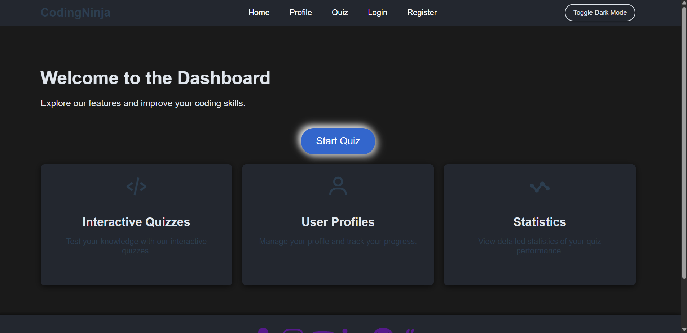

# Programming Quiz Hosted

A modern web application for hosting and taking programming quizzes on various languages and topics. Built with a clean, user-friendly interface using HTML, CSS, and JavaScript.

---

## 🚀 Features

- User registration and login
- Profile management
- Interactive quizzes on Java, C, C++, Python, SQL, CSS, DSA, JavaScript, and more
- Performance tracking and statistics
- Responsive design (works on desktop and mobile)
- Social and portfolio links
- Dark mode toggle

---

## 📸 Screenshots

<!--
Add screenshots here



-->

---

## 🛠️ Tech Stack

- **Frontend:** HTML, CSS, JavaScript (Vanilla)
- **Icons:** [Boxicons](https://boxicons.com/), [Tabler Icons](https://tabler.io/icons)
- **Other:** Node.js (for optional local development), Vercel (for portfolio)

---

## 🔗 All Links

- **Portfolio:** [portfolio-react-app-rho.vercel.app](https://portfolio-react-app-rho.vercel.app/)
- **GitHub:** [Pravin-Sonwane-2004](https://github.com/Pravin-Sonwane-2004)
- **Buy Me a Coffee:** [buymeacoffee.com/devpravin](https://buymeacoffee.com/devpravin)
- **Instagram:** [@its.pravin.2004](https://www.instagram.com/its.pravin.2004)
- **YouTube:** [ProgrammingWithPravin](https://www.youtube.com/@ProgrammingWithPravin)
- **LinkedIn:** [pravin-sonwane-079a621ba](https://www.linkedin.com/in/pravin-sonwane-079a621ba/)

---

## 🧑‍💻 Getting Started

### Prerequisites
- Node.js and npm (optional, for running a local server)

### Installation & Running Locally

1. **Clone the repository:**
   ```bash
   git clone https://github.com/Pravin-Sonwane-2004/programming-quiz-hosted.git
   cd programming-quiz-hosted
   ```
2. **Serve the app locally:**
   - You can use any static server, e.g. [live-server](https://www.npmjs.com/package/live-server):
   ```bash
   npm install -g live-server
   cd client/public
   live-server
   ```
   - Or simply open `client/public/index.html` in your browser.

---

## 📚 User Manual

### 1. Registration & Login
- Go to the **Sign Up** page to create a new account. Fill in your name, email, and password.
- Already have an account? Use the **Login** page to sign in with your credentials.
- Forgot your password? Use the **Forgot Password** link on the login page to reset it.

### 2. Navigating the Dashboard
- After logging in, you will land on the **Dashboard**.
- Use the navigation bar to access **Home**, **Profile**, **Quiz**, **Login**, and **Register** pages.
- Your profile icon and performance stats are accessible from the **Profile** page.

### 3. Taking Quizzes
- Click the **Start Quiz** button or select a quiz topic from the dashboard.
- Choose from topics like Java, C, C++, Python, SQL, CSS, DSA, JavaScript, and more.
- Answer the questions. Your progress and score will be tracked automatically.

### 4. Viewing Performance
- After completing a quiz, view your performance summary.
- Go to the **Profile** page to see your quiz history and statistics.

### 5. Dark Mode
- Use the **Toggle Dark Mode** button in the navigation bar to switch between light and dark themes.
- Your preference is saved for future visits.

### 6. Social & Portfolio Links
- Find quick links to your **Portfolio**, **GitHub**, **Instagram**, **YouTube**, **LinkedIn**, and **Buy Me a Coffee** in the footer of every page.
- Click any icon to visit the respective page in a new tab.

---

## 🤝 Contributing

Contributions, issues, and feature requests are welcome!

1. Fork the repository
2. Create your feature branch (`git checkout -b feature/YourFeature`)
3. Commit your changes (`git commit -m 'Add some feature'`)
4. Push to the branch (`git push origin feature/YourFeature`)
5. Open a pull request

---

## 📄 License

This project is licensed under the MIT License.

---

## 🙏 Acknowledgements

- [Boxicons](https://boxicons.com/)
- [Tabler Icons](https://tabler.io/icons)
- [Vercel](https://vercel.com/)

---

## 🖼️ Screenshots

<!--
Leave this space for screenshots. Add your images in a `screenshots/` folder and reference them here.
-->
